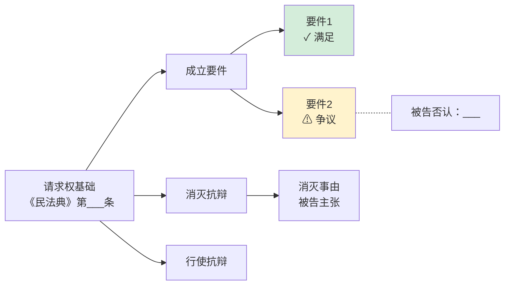

# 要件攻防分析

## 一、核心逻辑

**审理原则**：程序先于实体 → 法律先于事实 → 原告先于被告。

**工作方式**：不同时处理两个故事，分阶段依次审查——

- 原告阶段仅看原告陈述：你说的这些如果为真，法律上能否支持你的诉请？
- 被告阶段仅看被告陈述：你说的这些如果为真，法律上能否挡住原告？
- 陈述阶段不审查真假，仅审查**法律合理性**；
- 双方陈述均合理且存在矛盾时，才进入证据阶段确定真假。

**实战收益**：经法律审查筛选后，大量案件不必进入证据比拼即可明确方向。

## 二、输入与触发

```
用户触发
  │
  ├─ AskUserQuestion：您的代理立场？
  │   (a) 原告/上诉人/申请人
  │   (b) 被告/被上诉人/被申请人
  │
  ├─ AskUserQuestion：目前手上有哪些材料？
  │   (1) 仅有原告起诉状 → 从原告阶段开始
  │   (2) 起诉状 + 答辩状 → 连续完成原、被告阶段
  │   (3) 双方诉辩 + 证据册 → 全流程含证据阶段
  │
  └─ 自动判断起始阶段并执行
```

## 三、审查流程

### 3.1 原告阶段

**审查问题**：原告主张在法律上能否支持其诉请？

1. 确定诉请（转为法律表达）；
2. 遍检候选请求权基础（依 `examination-sequence.md`），列清单 **→ AskUserQuestion 确认候选清单**；
3. 构建攻防审查框架（依 `outline-engine.md`：找法→分类→构建→拆解→成型）**→ AskUserQuestion 确认框架**；
4. 逐项审查原告陈述能否满足各请求权基础的要件：
   - 权利是否产生（构成要件逐项审查）
   - 权利未消灭（消灭事由审查）
   - 权利可行使（行使障碍审查）
   - 对己不利陈述亦须审查
5. 阶段结论：

| 结论 | 后续 |
|------|------|
| 法律上站不住 | **短路终结**——不进被告阶段 |
| 部分站得住 | 仅合理部分进入被告阶段 |
| 法律上站得住 | 进入被告阶段 |

6. 渲染攻防结构图（仅原告侧节点）。

> 释明提示：站不住时，提示用户是否存在遗漏陈述。

### 3.2 被告阶段

**前提**：原告诉请至少部分在法律上站得住。

**审查问题**：被告防御在法律上能否成立？

1. 识别被告防御手段：

| 类型 | 性质 | 主张责任 |
|------|------|---------|
| 否认 | 否认原告陈述的事实 | 无（但不允许整体否认） |
| 抗辩 | 权利障碍/消灭/阻止 | 被告承担 |

2. 以通过原告阶段的请求权基础为引导，逐项审查被告陈述能否满足防御规范；
3. 主动检索法定消极规范（即使被告未明确主张）——发现潜在抗辩标注 `[风险提示]`；
4. 阶段结论：

| 结论 | 后续 |
|------|------|
| 防御站不住 | **短路终结**——原告不经举证胜诉 |
| 部分站得住 | 未被防御的请求权基础直接成立 |
| 防御站得住 | 进入反抗辩/证据阶段 |

5. 补填攻防结构图（被告侧节点 + 争议标橙）；
6. 产出**要件-陈述-证据对照表**。

> 关键规则：只要有一项请求权基础未被合理防御，原告即因该项胜诉。

### 3.3 反抗辩与再抗辩

- **反抗辩**：被告抗辩站得住时，原告可提反击；审查方式同原告阶段。
- **再抗辩**：原告反抗辩站得住时，被告可再反击；审查方式同被告阶段。
- 任一方未提出或不合理 → 对方胜诉。

### 3.4 证据阶段

**前提**：双方主张都在法律上站得住且存在事实矛盾。

**核心规则**：
- 一方主张且对方认可 → 视为真实，不举证；
- 仅双方有争议**且**具法律意义的事项 → 需举证。

**操作**：
1. 从攻防结构中提取待证事实；
2. 分配举证责任（成立要件→原告；消灭/阻止→被告；法定倒置从其规定）；
3. 输出**待证事实清单**（含举证结果推演）。

后续交付 `/证据目录`、`/质证意见`、`/庭审提纲`。

### 3.5 短路决策树

```
原告阶段
├── 站不住 → 原告败诉方向（终结）
└── 站得住 → 被告阶段
    ├── 被告未防御 → 原告胜诉方向（终结）
    ├── 防御站不住 → 原告胜诉方向（终结）
    └── 防御站得住
        ├── 原告无/不合理反抗辩 → 被告抗辩成立
        └── 原告反抗辩合理
            ├── 被告无/不合理再抗辩 → 原告胜诉方向
            └── 被告再抗辩合理 → 证据阶段
```

## 四、输出产物

| 产物 | 产出时机 | 格式 |
|------|---------|------|
| 攻防审查报告（各阶段） | 每阶段完成后 | .md |
| Mermaid 攻防结构图 | 随报告嵌入 | mermaid 代码块 |
| 要件-陈述-证据对照表 | 被告阶段后 | .md 表格 |
| 待证事实清单 + 举证责任分配 | 证据阶段 | .md 表格 |
| 诉讼策略备忘录 | 各阶段追加 | .md |

> ⛔ 交付前必过闸门（见 qoder.md「法律核验闸门」）：核验对象为攻防审查报告全文。报告经 `/法律核验` 放行后询问是否转 Word。

### 4.1 报告写作规范

- 采用**直接论断**（"满足/不满足"），不用假设语气；
- 明显满足的要件一句话带过，争议要件详细展开论证（参 `proportionality.md`）；
- 涉不确定概念时调用 `legal-interpretation-toolkit.md`；
- 每项请求权基础完整审查三层（产生/消灭/行使）；
- 法条号经 MCP 校验（依 `analytical-discipline.md`）。

### 4.2 攻防结构图规范

每项请求权基础一棵 **LR 攻防树**：



- 原告阶段：仅填原告侧（要件满足/不满足）
- 被告阶段：补填被告侧（否认用 `-.-` 虚线，抗辩用 `-->` 实线）
- 争议标橙 `#fff3cd`、满足标绿 `#d4edda`、不满足标红 `#f8d7da`

### 4.3 策略备忘录

**谨慎度规则**：

| 已完成阶段 | 谨慎度 |
|-----------|--------|
| 仅原告阶段 | 高度谨慎——仅方向性判断 + "待对方应诉后重新评估" |
| 被告阶段及以后 | 可给区间概率，标注 `[请审阅:主观判断]` |

**主诉视角**侧重：请求权基础选择、要件证据充分性、反抗辩准备、结果预判。

**被诉视角**侧重：原告薄弱点、我方防御方案、结果预判、和解评估（可选）。

标记词汇：`[待验证:事实]` / `[需引用:法条]` / `[请审阅:主观判断]` / `[证据缺口]` / `[风险提示]`

## 五、知识库预检索（可选）

> 触发条件：`qoder.md`「知识库方案」已配置且可用。未配置则跳过。
> 间接依赖：本节通过 `/诉讼知识库` skill 间接使用 qmind 或 COLLAB.doc_* 后端，MCP 可用性由该 skill 自行预检。

调用 `/诉讼知识库` 问答路径，输入案由+核心争议+请求权基础关键词，获取团队历史攻防策略作为参考。返回结果标注 `[KB:诉讼知识库]`，不替代正式法律检索。

## 六、MCP 预检与调用

### MCP 预检

执行分析前，先调用 `qw_mcp_list` 探测法律检索后端（关键词：`law`/`yuandian`/`pkulaw`/`法宝`）是否可用。
- **可用** → 法条校验和案例检索自动执行，静默继续。
- **不可用** → 用 `AskUserQuestion` 告知用户："法律检索 MCP 未连接，要件分析中的法条和案例辅助将无法自动校验。本技能内置方法论可独立运行，分析框架不受影响。建议前往 QoderWork → 设置 → 连接器 中配置元典或北大法宝。是否暂不配置、以降级模式继续？"
  - 用户选择继续 → 降级执行，标注 `[L4-法条待验证]`/`[L4-案例待验证]`

### MCP 调用

- **法条检索**（法律检索后端 LAW.*）：条文号/原文首次出现前须经 MCP 校验；不可用时标注 `[L4-法条待验证]`。
- **案例检索**（LAW.case_search / LAW.case_semantic）：可选，辅助策略备忘录。不可用时标注 `[L4-案例待验证]`。

### 降级策略

| 不可用场景 | 降级方案 | 标注 |
|-----------|---------|------|
| 法律检索后端不可用 | 基于内置 methodology/ 继续分析，法条引用基于模型知识 | `[L4-法条待验证]` |
| 案例检索不可用 | 跳过案例辅助，不阻塞要件审查 | `[L4-案例待验证]` |
| 全部 MCP 不可用 | 纯方法论分析，输出框架与结论，附待验证清单 | 顶部附加降级提示 |

> 降级模式下在输出顶部附加："当前以降级模式运行。如需启用自动校验，请前往 QoderWork → 设置 → 连接器 配置对应 MCP 服务。"
> 通用降级规则详见 qoder.md「MCP 预检协议 → 降级规则」。

## 七、方法论加载规则

methodology/ 为本 skill 的分析内核。加载规则：

- 全局总览：`relationstechnik.md`（五阶段流程框架——启动分析时首先加载，确认整体节奏）
- 原告阶段：`examination-sequence.md`（检索排序）+ `outline-engine.md`（框架构建）+ `inner-structure.md`（三层审查）+ `proportionality.md`（深度控制）
- 被告阶段：`inner-structure.md`（否认 vs 抗辩归位）+ `proportionality.md`
- 论证展开：`legal-interpretation-toolkit.md`（法律解释）
- 全程：`analytical-discipline.md`（法条引用 + 品质纪律）
- 框架速查：`references/element-templates.md`（常见请求权审查模板）

## 八、执行规则

1. 陈述阶段严禁以"证据是否充分"为标准——仅审查"陈述能否满足规范要件"。
2. 候选清单与攻防框架须分别 AskUserQuestion 确认后再展开论证。
3. 管辖异议等纯程序问题走 `/程序性文书系列`。
4. 方法论不可改动；输出与 methodology/ 冲突时以 methodology/ 为准。
5. 请求权规范竞合时遍检所有候选基础，不替当事人择一。

## 九、跨技能关联

| 上游 | 本 skill | 下游 |
|------|---------|------|
| `/案件事实梳理` → 事实基础 | 攻防分析 | → `/主诉诉状`（论证骨架） |
| `/案件管家` → 案件信息 | | → `/被诉答辩状`（抗辩结构） |
| `/诉讼知识库` → 历史策略 | | → `/证据目录`（按待证事实分组） |
| | | → `/质证意见`（针对对方证据） |
| | | → `/庭审提纲`（争议焦点+询问清单） |
